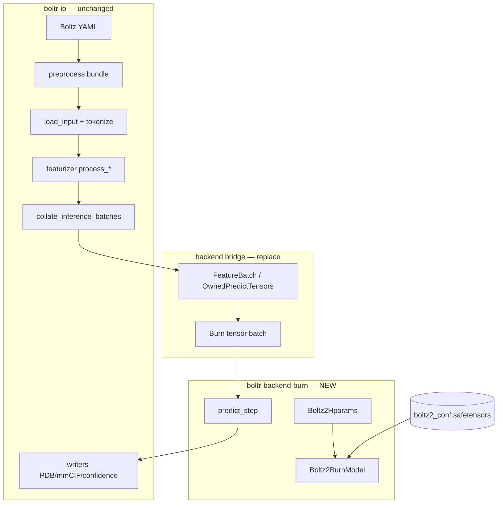

# Boltr_Burn → Boltr Native Migration

**Document:** Product Requirements + Technical Specification  
**Audience:** Development team  
**Repository:** `/home/s4mpl3bi4s/boltr_burn` (project root)  
**Production target:** [Boltr](https://github.com/SampleBias/Boltr) (`../Boltr` on this machine)

---

## Executive prompt (give this to the team)

> **Mission:** Build **Boltr_Burn**, a fully Rust-native Boltz-2 inference backend using [Burn ML](https://burn.dev), developed in parallel with Boltr and validated against the existing `boltr-backend-tch` + safetensors pipeline. Boltr_Burn is the **model laboratory**; Boltr is the **production integration target**. When Boltr_Burn reaches parity on a fixed fixture matrix, merge it into Boltr as `boltr-backend-burn` and make it the default inference backend, retiring the LibTorch (`tch-rs`) dependency for end users.
>
> **Non-negotiable:** Numerical parity with PyTorch Boltz on the **`use_kernels=False`** path (same contract as Boltr today). Do not chase cuEquivariance kernel parity in v1.
>
> **Reuse:** Do not reimplement I/O. **`boltr-io` is backend-agnostic** and stays the single source of truth for YAML → featurizer → collate → writers. Only the tensor runtime and model graph move to Burn.
>
> **Reference implementations:** Use **`boltr-backend-tch`** as the primary port guide (already module-aligned with `boltz-reference/`), not a greenfield rewrite from Python.

---

## 1. Problem statement

### Current state (Boltr today)

| Layer | Implementation | Dependency |
|-------|----------------|------------|
| Input / preprocess / featurizer / collate / writers | `boltr-io` | Pure Rust, no ML framework |
| Model graph (trunk, diffusion, confidence, affinity) | `boltr-backend-tch` | **`tch-rs` → LibTorch C++** |
| Weights | Lightning `.ckpt` → `.safetensors` export → `VarStore::load_partial` | Python export script (dev-only) |
| CLI / Web | `boltr-cli`, `boltr-web` spawn `boltr predict` | Feature flag `--features tch` |

**Clarification:** Boltr does **not** use Python FFI bindings at inference time. The runtime dependency to eliminate is **`tch-rs` / LibTorch** — a heavy C++ runtime with version pinning (currently `tch 0.16` ↔ LibTorch 2.3.x), compile-time Python coupling when using `LIBTORCH_USE_PYTORCH=1`, and deployment friction on GPU servers.

Python appears only for:

- Optional Boltz preprocess subprocess (`boltr predict --preprocess boltz`)
- Checkpoint export and golden tensor generation (dev/regression)

### Target state (Boltr + Boltr_Burn)

| Layer | Implementation | Dependency |
|-------|----------------|------------|
| I/O (unchanged) | `boltr-io` | Pure Rust |
| Model graph | `boltr-backend-burn` | **Burn + CubeCL** (CUDA/WGPU/CPU) |
| Weights | Same `.safetensors` files, loaded via **`burn-store`** into Burn `Module` graph |
| Dev workspace | **boltr_burn** (this repo) | Standalone Burn backend + parity harness |
| Production | Boltr workspace | `boltr-cli --features burn` replaces `--features tch` |

### Why this is feasible (honest assessment)

**Yes, it is possible** — but it is a **backend re-port**, not a weight-format change.

Evidence from Boltr:

- The hard architectural work is **already done** in Rust (`boltr-backend-tch`: trunk, pairformer, triangular ops, MSA, templates, diffusion sampler, confidence, affinity — see Boltr `TODO.md` §5, largely complete).
- `boltr-io` already produces a **`FeatureBatch`** consumed via `collate_predict_bridge.rs`; that bridge is the seam to replace.
- Golden infrastructure exists: per-module safetensors, opt-in allclose tests, regression harness (`scripts/regression_compare_predict.sh`).
- Burn natively supports **safetensors import** and multiple GPU backends; it even offers a **LibTorch backend** as a potential stepping stone.

**Hard parts (plan for these explicitly):**

1. **Triangular attention / triangular multiplication** — O(N³) pair ops; Burn may need custom CubeCL kernels for competitive GPU performance.
2. **Atom transformer windowing** — non-standard attention patterns (`atom_transformer_window_w_ne_h` tests exist in Boltr).
3. **EDM diffusion sampler** — iterative loop with steering/potentials; must match sampling semantics, not just single forward passes.
4. **Mixed precision islands** — Boltz disables autocast in specific blocks; Burn dtype policy must mirror this.
5. **Strict weight key alignment** — same `state_dict` naming as today (`inference_keys.rs`, `verify_boltz2_safetensors`).

**Not feasible as a short-cut:** Loading safetensors into Burn **without** reimplementing the graph. Safetensors are weights only; the computation graph must exist as Burn `Module` types.

---

## 2. Goals and non-goals

### Goals (v1)

1. **Full Rust-native inference** — no LibTorch in the default production binary.
2. **Parity** with `boltr-backend-tch` on the existing golden + regression fixture matrix.
3. **Same user-facing API** — `boltr predict` flags, output tree, `boltr_predict_args.json` unchanged.
4. **Same weight artifacts** — reuse `boltz2_conf.safetensors`, `boltz2_aff.safetensors`, `boltz2_hparams.json`.
5. **Boltr_Burn as isolated dev loop** — faster iteration without destabilizing main Boltr.

### Non-goals (v1)

- cuEquivariance / fused triangle kernels from upstream Boltz CUDA extra
- Training / fine-tuning in Burn
- Replacing Python preprocess entirely (native preprocess continues separately in Boltr)
- ONNX export (future)
- Performance beating LibTorch on day one (parity first, optimize second)

---

## 3. Architecture

### Workspace layout

**Phase 0 — boltr_burn (this repo)**

```
boltr_burn/
├── Cargo.toml                    # workspace
├── README.md
├── BOLTR_BURN_PRD_AND_SPEC.md    # this document
├── boltr-io/                     # path dep → ../Boltr/boltr-io
├── boltr-backend-core/           # NEW: shared hparams, predict_args, tensor key taxonomy
├── boltr-backend-burn/           # NEW: Burn Module graph (mirror boltr-backend-tch layout)
├── boltr-burn-cli/               # slim CLI: module goldens, predict on fixtures, doctor
├── boltr-burn-bridge/            # FeatureBatch → Burn tensors
├── scripts/                      # reuse Boltr golden exporters
├── boltz-reference/              # submodule (minimal, for Python goldens)
└── tests/fixtures/               # symlink or copy from Boltr fixtures
```

**Phase 3 — merge into Boltr**

```
Boltr/
├── boltr-io/                     # unchanged
├── boltr-backend-core/           # extracted from boltr_burn
├── boltr-backend-burn/           # merged from boltr_burn
├── boltr-backend-tch/            # deprecated, then removed
├── boltr-cli/                    # --features burn | tch (tch deprecated)
└── boltr-web/                    # doctor checks Burn backend
```

### Data-flow (unchanged I/O, swapped backend)



### Module mapping (port guide)

Mirror `../Boltr/boltr-backend-tch/src/` → `boltr-backend-burn/src/`:

| tch module | Burn module | Python reference | Golden test |
|------------|-------------|------------------|-------------|
| `boltz2/input_embedder.rs` | `boltz2/input_embedder.rs` | `encodersv2.py` | `BOLTR_RUN_INPUT_EMBEDDER_GOLDEN` |
| `boltz2/relative_position.rs` | same | `trunkv2.py` | trunk init golden |
| `boltz2/trunk.rs` | same | `trunkv2.py` | collate_predict_trunk |
| `boltz2/msa_module.rs` | same | `trunkv2.py` | MSA module golden |
| `layers/pairformer.rs` | same | `pairformer.py` | pairformer golden |
| `layers/triangular_*.rs` | same | `triangular_*.py` | **new** triangle goldens |
| `boltz2/template_module.rs` | same | `trunkv2.py` | **TBD** in tch too |
| `boltz2/diffusion*.rs` | same | `diffusionv2.py` | **new** 1-step sampler golden |
| `boltz2/confidence.rs` | same | `confidencev2.py` | confidence golden |
| `boltz2/affinity.rs` | same | `affinity.py` | affinity golden |
| `boltz2/model.rs` | same | `boltz2.py` | predict_step_smoke |

**Rule:** Every completed row in Boltr `TODO.md` §5 must have a corresponding Burn port task with the **same golden fixture**.

---

## 4. Technical specification

### 4.1 Backend abstraction (introduce in boltr_burn, merge to Boltr)

Define a backend-agnostic trait in `boltr-backend-core`:

```rust
pub trait Boltz2Backend {
    type Device;
    type FloatTensor;
    type IntTensor;

    fn predict_step(
        model: &Boltz2Model<Self>,
        feats: PredictStepFeats<Self>,
        args: &Boltz2PredictArgs,
    ) -> Result<PredictStepOutput<Self>>;
}
```

Implementations:

- `TchBackend` — thin wrapper over existing `boltr-backend-tch` (for A/B during migration)
- `BurnBackend<B: Backend>` — new Burn implementation

CLI selects via feature flag: `boltr predict` → `predict_burn::run_predict_burn()` or `predict_tch::run_predict_tch()`.

Move shared types out of tch crate:

- `Boltz2Hparams` (`../Boltr/boltr-backend-tch/src/boltz_hparams.rs`)
- `Boltz2PredictArgs`, `resolve_predict_args`
- `PredictStepFeats` / `PredictStepOutput` field names (`../Boltr/boltr-backend-tch/src/boltz2/model.rs`)
- `inference_keys.rs` key taxonomy

### 4.2 Burn crate configuration

Recommended `boltr-backend-burn/Cargo.toml` features:

```toml
[features]
default = ["burn-cuda"]   # or burn-wgpu for dev laptops
burn-cuda = ["burn/cuda", "burn/cubecl"]
burn-wgpu = ["burn/wgpu"]
burn-ndarray = ["burn/ndarray"]  # CPU-only CI
burn-tch = ["burn/tch"]          # OPTIONAL: parity bootstrap via Burn's LibTorch backend
```

**Suggested bootstrap strategy:** Optionally port modules first against **`burn-tch`** (Burn calling LibTorch ops) to validate Module wiring + weight loading, then switch default backend to **`burn-cuda`** and fix numeric drift. This de-risks graph structure from kernel correctness.

Pin Burn to a **single workspace version** (e.g. `0.21.x` at project start; re-evaluate quarterly).

### 4.3 Weight loading

**Input:** Existing files from `boltr download` (Boltr CLI):

- `~/.cache/boltr/boltz2_conf.safetensors`
- `~/.cache/boltr/boltz2_aff.safetensors`
- `~/.cache/boltr/boltz2_hparams.json`

**Requirements:**

1. Implement `Boltz2BurnModel::load_from_safetensors(path) -> Result<Self>` using `burn-store` with **strict key matching** (port logic from `load_from_safetensors_require_all_vars` in `../Boltr/boltr-backend-tch/src/boltz2/model.rs`).
2. Port `verify_boltz2_safetensors` → `verify_boltz2_burn_weights` binary.
3. Parameter names in Burn `Module` must match Lightning `state_dict` paths exactly (same as tch `VarStore` paths today).
4. Support optional heads: confidence, affinity (disable module if keys missing, same as tch).

**No change** to `../Boltr/scripts/export_checkpoint_to_safetensors.py` for v1.

### 4.4 Tensor bridge (FeatureBatch → Burn)

Replace `../Boltr/boltr-cli/src/collate_predict_bridge.rs` tch path with Burn equivalent:

| Source (`boltr-io`) | Burn tensor | Notes |
|---------------------|-------------|-------|
| `FeatureBatch` f32 arrays | `Tensor<B, D, Float>` | Match shapes in `manifest.json` |
| MSA block | same ranks as collate golden | `trunk_smoke_collate.safetensors` |
| Template features | optional | dummy + real templates |
| Masks / indices | `Int` tensor backend | `token_pad_mask`, atom indices |

Acceptance: Boltr `post_collate_golden.rs` passes unchanged; bridge produces Burn tensors that reproduce tch trunk output on `collate_predict_trunk` fixture.

### 4.5 Numerical parity policy

Follow Boltr docs:

- `../Boltr/docs/NUMERICAL_TOLERANCES.md`
- `../Boltr/docs/TENSOR_CONTRACT.md`

| Test class | rtol | atol |
|------------|------|------|
| Featurizer / collate | 1e-5 | 1e-6 |
| Module goldens (embedder, pairformer, MSA) | 1e-4 | 1e-5 |
| Full predict vs Boltz | per `regression_tol.env.example` | looser |

**Burn-specific:** Document separate tolerances if CubeCL kernels differ slightly; justify in `docs/BURN_NUMERICAL_TOLERANCES.md` (create in this repo).

### 4.6 Device / deployment

| Concern | Spec |
|---------|------|
| CPU CI | `burn-ndarray` backend, smoke tests only |
| GPU CI | `workflow_dispatch` CUDA job (mirror Boltr `libtorch-backend-smoke.yml`) |
| CLI device flags | `--device cpu`, `cuda`, `cuda:N` mapped to Burn device |
| Memory | Port `gpu_mem.rs` logic; respect `max_parallel_samples` |
| Web UI | `boltr doctor --json` reports Burn backend + device |

### 4.7 `predict_step` contract

Must match `Boltz2Model::predict_step` in `../Boltr/boltr-backend-tch/src/boltz2/model.rs`:

1. Trunk with recycling (`recycling_steps`)
2. Diffusion conditioning
3. Atom diffusion sample (`num_sampling_steps`, `diffusion_samples`, `max_parallel_samples`)
4. Distogram
5. Optional confidence
6. Optional affinity (+ MW correction)

Args precedence unchanged: **CLI > YAML predict_args > checkpoint > defaults** (`predict_args.rs`).

Outputs must feed existing writers in `boltr-io/src/write/` without modification.

---

## 5. boltr_burn dev environment spec

### Repository setup

1. This repo (`/home/s4mpl3bi4s/boltr_burn`) is the project root.
2. Add `boltr-io` as **path dependency** during dev:

   ```toml
   boltr-io = { path = "../Boltr/boltr-io" }
   ```

   Long-term: publish `boltr-io` as crate or git dep at tagged Boltr releases.

3. Copy or symlink fixture tree from `../Boltr/boltr-io/tests/fixtures/` and `../Boltr/boltr-backend-tch/tests/fixtures/`.
4. Bootstrap script `boltr_burn_bootstrap` (mirror `../Boltr/Boltr_Boltz_bootstrap`):

   - Rust toolchain ≥ 1.85
   - `boltr download` or copy cache from `~/.cache/boltr`
   - safetensors verify
   - `cargo test -p boltr-backend-burn`

### boltr_burn CLI commands (minimal)

| Command | Purpose |
|---------|---------|
| `boltr-burn doctor [--json]` | Burn backend + CUDA/WGPU probe |
| `boltr-burn verify-weights PATH` | Strict safetensors key check |
| `boltr-burn golden MODULE` | Run opt-in module golden vs Python |
| `boltr-burn predict FIXTURE.yaml` | End-to-end on fixture set |
| `boltr-burn compare-tch FIXTURE` | A/B tch vs burn on same collate |

### Daily dev loop

```bash
# Module-level (fast)
BOLTR_RUN_PAIRFORMER_GOLDEN=1 cargo test -p boltr-backend-burn pairformer

# Trunk smoke (medium)
cargo test -p boltr-backend-burn collate_predict_trunk

# Full fixture (slow, GPU)
boltr-burn predict ../Boltr/boltr-io/tests/fixtures/yaml/minimal_protein_only.yaml --device cuda
boltr-burn compare-tch same_fixture
```

---

## 6. Phased delivery plan

### Phase 0 — Foundation (2–3 weeks)

**Deliverables:**

- [ ] boltr_burn repo scaffold + CI (CPU)
- [ ] `boltr-backend-core` extracted (hparams, predict_args, inference keys)
- [ ] Burn dependency pinned; `doctor` command
- [ ] Weight verify binary passes on real `boltz2_conf.safetensors`

**Exit criteria:** Strict load of all inference keys into empty Burn model skeleton (modules stubbed with correct parameter shapes).

### Phase 1 — Trunk parity (4–6 weeks)

**Deliverables:**

- [ ] Input embedder, relative position, trunk init, MSA, pairformer, templates
- [ ] All existing module goldens pass on Burn
- [ ] `predict_step_trunk` on `trunk_smoke_collate.safetensors`

**Exit criteria:** Trunk output allclose vs tch backend on collate fixture (not just Python).

### Phase 2 — Diffusion + heads (4–6 weeks)

**Deliverables:**

- [ ] Diffusion conditioning + AtomDiffusion sampler
- [ ] Distogram, confidence, affinity modules
- [ ] Potentials / steering (`--use-potentials`)
- [ ] One-step and short-chain sampler goldens

**Exit criteria:** `predict_step_smoke` equivalent passes; structure coordinates within regression tolerances on minimal protein fixture.

### Phase 3 — Integration into Boltr (2–3 weeks)

**Deliverables:**

- [ ] Merge `boltr-backend-burn` + `boltr-backend-core` into Boltr workspace
- [ ] `boltr-cli --features burn` full predict path
- [ ] `boltr-web` status + predict jobs use Burn binary
- [ ] CUDA CI workflow for burn backend
- [ ] Document migration in Boltr README / DEVELOPMENT.md

**Exit criteria:** `BOLTR_REGRESSION=1 ../Boltr/scripts/regression_compare_predict.sh` passes Burn vs Boltz on fixture matrix.

### Phase 4 — Production cutover (2 weeks)

**Deliverables:**

- [ ] Burn default in release builds
- [ ] `tch` feature deprecated with timeline
- [ ] Deployment docs (no LibTorch install)
- [ ] Performance baseline report (Burn vs tch)

**Exit criteria:** Production deploy without LibTorch; tch retained one release cycle for rollback.

### Phase 5 — Optimization (ongoing)

- Custom CubeCL kernels for triangular ops
- bf16 inference paths where safe
- Kernel fusion / batching improvements

---

## 7. Acceptance criteria (definition of done)

### Module level

- [ ] Every module in Boltr `TODO.md` §5 has Burn port + golden or trunk integration test
- [ ] `verify_boltz2_burn_weights` exit 0 on full checkpoint

### Integration level

- [ ] `boltr predict` (burn) produces same output tree as tch build
- [ ] Confidence JSON, PAE/PDE/plddt npz keys match
- [ ] Affinity JSON matches on affinity fixtures

### Regression level

- [ ] Fixed fixture matrix (document in `docs/BURN_PARITY_FIXTURES.md`):

  - `minimal_protein_only.yaml`
  - `multi_chain_entity.yaml`
  - template + MSA smoke fixtures
  - optional affinity fixture

- [ ] Regression harness extended: `regression_compare_predict.sh --backend burn`

### Operational level

- [ ] Single static binary deploy (no Python torch, no LibTorch)
- [ ] `boltr doctor --json` green on target GPU hosts
- [ ] Documented VRAM guidance matches or beats tch within 20%

---

## 8. Risks and mitigations

| Risk | Likelihood | Impact | Mitigation |
|------|------------|--------|------------|
| Triangle op perf regression vs LibTorch | High | High | Phase 5 CubeCL kernels; accept slower v1 if parity met |
| Numeric drift on GPU (CubeCL vs CUDA) | Medium | High | Module goldens on CPU first; separate GPU tolerances if needed |
| Burn API churn | Medium | Medium | Pin version; avoid nightly |
| Duplicate maintenance (tch + burn) | High | Medium | Time-box tch; module parity gates before merge |
| Weight key mismatch after port | Medium | High | Port verify binary first; strict load before forward |
| Atom transformer windowing bugs | Medium | High | Port `atom_transformer_window_w_ne_h` test early |
| Team underestimates diffusion sampler | Medium | High | Milestone Phase 2 gated on 1-step golden before full chain |

---

## 9. Team roles (suggested)

| Role | Owns |
|------|------|
| **Backend lead** | Burn crate architecture, Module trait design, merge strategy |
| **Parity engineer** | Golden tests, regression harness, tch↔burn A/B |
| **GPU engineer** | CUDA/WGPU device plumbing, CubeCL kernels (Phase 5) |
| **I/O liaison** | `boltr-io` contract changes (should be rare) |
| **DevOps** | CI matrices, RunPod/GPU images without LibTorch |

---

## 10. Open questions (decide in week 1)

1. **Repo strategy:** Separate boltr_burn repo (current) vs long-lived branch in Boltr?
2. **Bootstrap backend:** Start on `burn-ndarray` (CPU), `burn-cuda`, or `burn-tch` stepping stone?
3. **Preprocess:** Keep Boltz Python subprocess indefinitely or block on native preprocess parity?
4. **Deprecation timeline:** How many releases keep `--features tch` for rollback?
5. **Minimum GPU target:** NVIDIA only v1, or WGPU/ROCm from day one?

---

## 11. Reference documents (Boltr sibling repo)

Read before writing code (paths relative to `../Boltr`):

| Doc | Why |
|-----|-----|
| `TODO.md` | Module completion status — Burn port tracks this list |
| `docs/TENSOR_CONTRACT.md` | Tensor names, shapes, predict_args |
| `docs/NUMERICAL_TOLERANCES.md` | allclose thresholds |
| `docs/PYTHON_REMOVAL.md` | When Python can shrink (unchanged policy) |
| `DEVELOPMENT.md` | Current LibTorch pitfalls Burn should avoid |
| `boltr-backend-tch/src/boltz2/model.rs` | `predict_step` orchestration |
| `boltr-cli/src/collate_predict_bridge.rs` | Integration seam to replace |
| `boltr-backend-tch/src/inference_keys.rs` | Weight key taxonomy |

---

## 12. Feasibility verdict (for stakeholders)

**Boltr_Burn is feasible because the model has already been decomposed and ported to Rust once** (`boltr-backend-tch`, ~12k LOC, full Boltz2 graph). The migration is **re-targeting that graph onto Burn's `Module` + tensor APIs**, reusing the same safetensors weights and the same `boltr-io` pipeline — not re-deriving biology or architecture from Python. The main cost is **engineering time** (estimate **3–4 months** for parity with a small senior team, plus ongoing GPU optimization), with **triangular pair ops and diffusion sampling** as the highest-risk components. LibTorch elimination is a **deployment and maintainability win**, not a research bet.

---

*Last updated: 2026-06-28*
