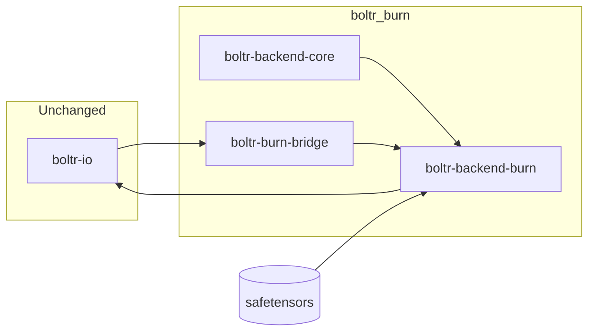

# Boltr_Burn

[](https://github.com/SampleBias/boltr_burn/actions/workflows/ci.yml)
[](LICENSE)

**Rust-native Boltz-2 inference backend** using [Burn ML](https://burn.dev). This repository is the **model development laboratory** for replacing LibTorch (`tch-rs`) in [Boltr](https://github.com/SampleBias/Boltr) with a fully Rust-native stack.

| Repository | Role |
|------------|------|
| **boltr_burn** (this repo) | Burn backend development, module goldens, parity harness |
| **[Boltr](https://github.com/SampleBias/Boltr)** | Production target: `boltr-io`, CLI, web UI |

When Burn reaches parity on the fixed fixture matrix, this work merges into Boltr as `boltr-backend-burn` and becomes the default inference backend.

---

## Why Boltr_Burn?

Boltr already implements the full Boltz-2 graph in Rust via `boltr-backend-tch` (~12k LOC). Boltr_Burn **re-targets that graph onto Burn's `Module` + tensor APIs**, reusing:

- The same **`.safetensors`** weight artifacts (`boltz2_conf.safetensors`, etc.)
- The same **`boltr-io`** pipeline (YAML → featurizer → collate → writers)
- The same **numerical parity contract** (`use_kernels=False` PyTorch path)

The hard I/O and architecture decomposition work is done. This repo focuses on the backend re-port and validation.

---

## Status

**Phase 1 — Trunk parity** + **Phase 2 — Diffusion + heads** (module ports landed)

| Component | State |
|-----------|-------|
| `boltr-backend-core` | hparams, predict_args, inference keys, backend trait |
| `boltr-backend-burn` | Trunk, pairformer, MSA, templates, diffusion sampler, distogram, confidence, affinity |
| `boltr-burn-cli` | `doctor`, `verify-weights`, `hparams` |
| `boltr-burn-bridge` | Stub (Phase 3 integration) |
| End-to-end `predict` | Phase 3 (Boltr merge) |

See **[docs/IMPLEMENTATION_PLAN.md](docs/IMPLEMENTATION_PLAN.md)** for the full phased roadmap.

---

## Quick start

### Prerequisites

- Rust **≥ 1.85** (`rustup update stable`)
- Optional: [Boltr](https://github.com/SampleBias/Boltr) checked out alongside this repo for local `boltr-io` path override and golden fixtures
- Optional: Boltz-2 weights in `~/.cache/boltr/` (via `boltr download` from Boltr)

### Bootstrap

```bash
git clone https://github.com/SampleBias/boltr_burn.git
cd boltr_burn
./boltr_burn_bootstrap
```

### Doctor

```bash
cargo run -p boltr-burn-cli -- doctor
cargo run -p boltr-burn-cli -- doctor --json
```

Reports compiled Burn backends (`burn-ndarray` by default), and whether weight cache files exist.

### Verify weights

Check skeleton parameter keys against a safetensors checkpoint:

```bash
cargo run -p boltr-backend-burn --bin verify_boltz2_burn_weights -- \
  --partition ~/.cache/boltr/boltz2_conf.safetensors
```

For **full VarStore parity** (all inference keys), use Boltr's LibTorch verifier until the Burn graph is complete:

```bash
# In Boltr repo, with LibTorch installed
cargo run -p boltr-backend-tch --features tch-backend --bin verify_boltz2_safetensors -- \
  ~/.cache/boltr/boltz2_conf.safetensors
```

---

## Workspace layout

```
boltr_burn/
├── boltr-backend-core/     # Shared hparams, predict_args, inference key taxonomy
├── boltr-backend-burn/     # Burn Module graph (mirrors boltr-backend-tch layout)
├── boltr-burn-bridge/      # FeatureBatch → Burn tensors
├── boltr-burn-cli/         # Dev CLI: doctor, verify-weights, golden, predict
├── docs/
│   ├── IMPLEMENTATION_PLAN.md
│   └── BURN_NUMERICAL_TOLERANCES.md
├── scripts/                # (Phase 1+) golden exporters, regression helpers
├── BOLTR_BURN_PRD_AND_SPEC.md
└── boltr_burn_bootstrap
```

### Local development with Boltr checkout

When Boltr is at `../Boltr`, override the git dependency for faster iteration:

```toml
# .cargo/config.toml (local only — do not commit)
[patch."https://github.com/SampleBias/Boltr.git"]
boltr-io = { path = "../Boltr/boltr-io" }
```

---

## Building

### CPU (default — CI and laptops)

```bash
cargo build --release -p boltr-burn-cli
cargo test --all
```

### CUDA (GPU servers)

```bash
cargo build -p boltr-backend-burn --release --features burn-cuda
cargo build -p boltr-burn-cli --release
```

### WGPU (cross-vendor GPU)

```bash
cargo build -p boltr-backend-burn --release --features burn-wgpu
```

---

## CLI reference

| Command | Purpose |
|---------|---------|
| `boltr-burn doctor [--json]` | Burn backend + weight cache probe |
| `boltr-burn verify-weights PATH` | Safetensors key check vs Burn skeleton |
| `boltr-burn hparams PATH.json` | Print resolved model dimensions |
| `boltr-burn predict FIXTURE.yaml` | End-to-end predict (Phase 2+) |
| `boltr-burn compare-tch FIXTURE` | A/B tch vs burn (Phase 1+) |
| `boltr-burn golden MODULE` | Opt-in module golden vs Python (Phase 1+) |

---

## Development loop

```bash
# Fast: core types + skeleton tests
cargo test -p boltr-backend-core
cargo test -p boltr-backend-burn

# Module goldens (Phase 1+, GPU optional)
BOLTR_RUN_PAIRFORMER_GOLDEN=1 cargo test -p boltr-backend-burn pairformer

# Full fixture (Phase 2+, GPU)
boltr-burn predict ../Boltr/boltr-io/tests/fixtures/yaml/minimal_protein_only.yaml --device cuda
```

---

## Architecture



**Rule:** Do not reimplement I/O. Only the tensor runtime and model graph live here. Port guide: `boltr-backend-tch/src/` → `boltr-backend-burn/src/` (same module names).

---

## Phased delivery (summary)

| Phase | Duration | Deliverable |
|-------|----------|-------------|
| **0 — Foundation** | 2–3 weeks | Scaffold, core types, doctor, verify (current) |
| **1 — Trunk parity** | 4–6 weeks | Embedder, pairformer, MSA, templates; trunk goldens |
| **2 — Diffusion + heads** | 4–6 weeks | Sampler, distogram, confidence, affinity |
| **3 — Boltr merge** | 2–3 weeks | `boltr-cli --features burn`, regression harness |
| **4 — Cutover** | 2 weeks | Burn default; deprecate tch |
| **5 — Optimization** | ongoing | CubeCL triangle kernels, bf16 |

Full detail: **[docs/IMPLEMENTATION_PLAN.md](docs/IMPLEMENTATION_PLAN.md)** and **[BOLTR_BURN_PRD_AND_SPEC.md](BOLTR_BURN_PRD_AND_SPEC.md)**.

---

## Parity policy

Follow Boltr's numerical contracts:

- [NUMERICAL_TOLERANCES.md](https://github.com/SampleBias/Boltr/blob/main/docs/NUMERICAL_TOLERANCES.md)
- [TENSOR_CONTRACT.md](https://github.com/SampleBias/Boltr/blob/main/docs/TENSOR_CONTRACT.md)
- [BURN_NUMERICAL_TOLERANCES.md](docs/BURN_NUMERICAL_TOLERANCES.md) (Burn-specific notes)

---

## Contributing

1. Read **[BOLTR_BURN_PRD_AND_SPEC.md](BOLTR_BURN_PRD_AND_SPEC.md)** and **[docs/IMPLEMENTATION_PLAN.md](docs/IMPLEMENTATION_PLAN.md)**
2. Mirror module completion in [Boltr TODO.md §5](https://github.com/SampleBias/Boltr/blob/main/TODO.md)
3. Every ported module needs the **same golden fixture** as `boltr-backend-tch`
4. `cargo fmt`, `cargo clippy`, `cargo test` must pass before PR

---

## Related documentation (Boltr)

| Document | Why |
|----------|-----|
| [TODO.md](https://github.com/SampleBias/Boltr/blob/main/TODO.md) | Module checklist to mirror |
| [DEVELOPMENT.md](https://github.com/SampleBias/Boltr/blob/main/DEVELOPMENT.md) | LibTorch pitfalls to avoid |
| [boltr-backend-tch/src/boltz2/model.rs](https://github.com/SampleBias/Boltr/blob/main/boltr-backend-tch/src/boltz2/model.rs) | `predict_step` orchestration |
| [boltr-cli/src/collate_predict_bridge.rs](https://github.com/SampleBias/Boltr/blob/main/boltr-cli/src/collate_predict_bridge.rs) | Integration seam to replace |

---

## License

MIT — see [LICENSE](LICENSE).

---

## Acknowledgments

Built in parallel with [Boltr](https://github.com/SampleBias/Boltr) and [Burn](https://burn.dev). Boltz-2 model architecture by the Boltz team.
