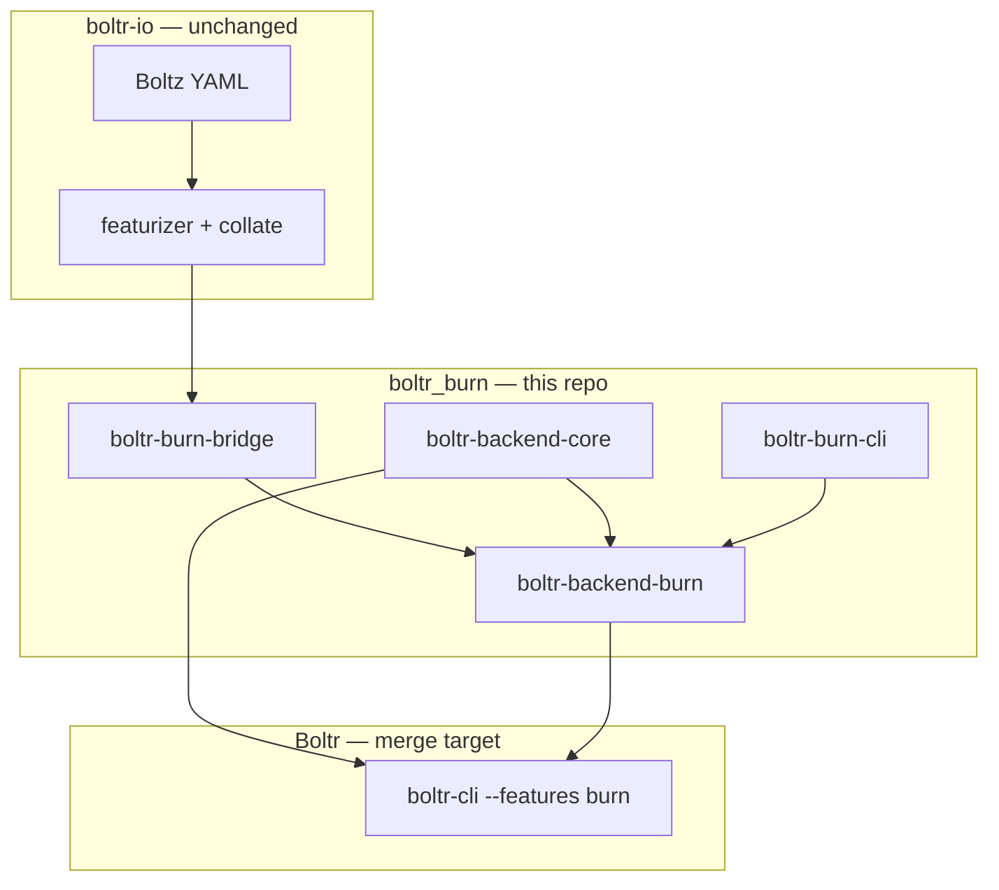

# Implementation plan

This document turns [BOLTR_BURN_PRD_AND_SPEC.md](../BOLTR_BURN_PRD_AND_SPEC.md) into an actionable delivery schedule. **Current status: Phase 1 trunk parity + Phase 2 diffusion/heads (landed).**

## Architecture summary



**Non-negotiable:** Numerical parity with PyTorch Boltz on the `use_kernels=False` path. Reuse `boltr-io`; port only the tensor runtime and model graph from `boltr-backend-tch`.

---

## Phase 0 — Foundation (current)

| Task | Status |
|------|--------|
| Workspace scaffold + MIT license | Done |
| `boltr-backend-core` (hparams, predict_args, inference_keys, backend trait) | Done |
| Burn 0.21 pinned; `boltr-burn doctor` | Done |
| Skeleton `Boltz2BurnModel` + `verify_boltz2_burn_weights` | Done |
| CPU CI (fmt, clippy, test) | Done |
| Bootstrap script | Done |

**Exit criteria (remaining):**

- [ ] Strict load of **all** inference keys into full Burn skeleton (modules stubbed with correct shapes)
- [ ] `verify_boltz2_burn_weights` exit 0 on real `boltz2_conf.safetensors` for skeleton keys present today

**Next actions:**

1. Port `input_embedder`, `relative_position`, trunk init goldens (mirror tch module files)
2. Wire `burn-store` safetensors import with strict key matching
3. Symlink or git-submodule Boltr fixtures into `tests/fixtures/`

---

## Phase 1 — Trunk parity (4–6 weeks)

| Module (tch → burn) | Golden test | Status |
|---------------------|-------------|--------|
| `input_embedder.rs` | `BOLTR_RUN_INPUT_EMBEDDER_GOLDEN` | Done (tail + atom repr) |
| `relative_position.rs` | trunk init golden | Done |
| `trunk.rs` | `collate_predict_trunk` | Done |
| `msa_module.rs` | MSA module golden | Done |
| `layers/pairformer.rs` | pairformer golden | Done |
| `layers/triangular_*.rs` | new triangle goldens | Done |
| `template_module.rs` | TBD | Done (shape tests) |

**Exit criteria:** Trunk output allclose vs `boltr-backend-tch` on collate fixture.

**Remaining:** Full `predict_step_trunk` collate fixture vs tch A/B; input embedder full atom stack golden.

**Daily loop:**

```bash
BOLTR_RUN_PAIRFORMER_GOLDEN=1 cargo test -p boltr-backend-burn pairformer
cargo test -p boltr-backend-burn collate_predict_trunk
```

---

## Phase 2 — Diffusion + heads (4–6 weeks)

| Module | Golden | Status |
|--------|--------|--------|
| `diffusion*.rs`, `diffusion_conditioning.rs` | 1-step sampler golden | Done (fast path; extended steering stubbed) |
| `distogram.rs`, `confidence.rs`, `affinity.rs` | existing goldens | Done (shape smoke; numerical goldens TBD) |
| Potentials / steering | `--use-potentials` fixtures | Partial (`SteeringParams`; extended sampler `todo!`) |

**Exit criteria:** Structure coordinates within regression tolerances on `minimal_protein_only.yaml`.

**Remaining:** Wire full `predict_step`; potentials port; `BOLTR_RUN_DIFFUSION_GOLDEN` numerical allclose; regression on minimal protein fixture.

---

## Phase 3 — Boltr integration (2–3 weeks)

- Merge `boltr-backend-burn` + `boltr-backend-core` into [Boltr](https://github.com/SampleBias/Boltr)
- `boltr-cli --features burn` predict path
- `boltr-web` doctor + jobs
- CUDA CI workflow

**Exit criteria:** `BOLTR_REGRESSION=1 scripts/regression_compare_predict.sh --backend burn` passes.

---

## Phase 4 — Production cutover (2 weeks)

- Burn default in release builds
- Deprecate `--features tch` with rollback timeline
- Deployment docs without LibTorch

---

## Phase 5 — Optimization (ongoing)

- Custom CubeCL kernels for triangular ops
- bf16 inference where safe
- Kernel fusion / batching

---

## Module port checklist

Track [Boltr TODO.md §5](https://github.com/SampleBias/Boltr/blob/main/TODO.md). Every completed tch row needs a Burn port + same golden fixture.

## Open decisions (week 1)

1. **Bootstrap backend:** `burn-ndarray` (CPU CI) + `burn-cuda` for GPU dev — **chosen for scaffold**
2. **Repo strategy:** Separate `boltr_burn` repo — **chosen**
3. **tch A/B:** Run Boltr's `verify_boltz2_safetensors` alongside Burn verify (avoid linking both torch-sys versions)
4. **Fixtures:** Git submodule `Boltr` vs copied fixtures — recommend submodule for goldens

---

*Last updated: 2026-06-29*
